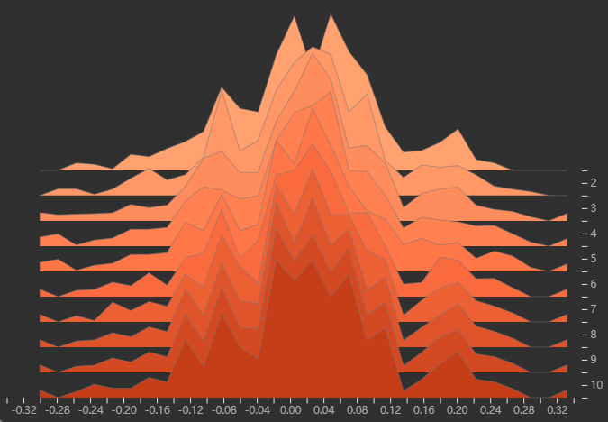

# PyTorch Basic Practice for Beginners

This repository provides tutorial for **deep learning researchers** and **PyTorch beginners** to learn and practice [PyTorch](https://github.com/pytorch/pytorch). Introduced from the foundation of PyTorch, this repo includes five parts of model training, including **data**, **model**, **loss function**, **optimizer** and **iterative training visualization**. In addition to the basic use of PyTorch, there are some classic hands-on projects which be used to practice, most of which are connected to **Computer Vision**, and one of which is related to **Natural Language Processing**.

## Environment

the codes have been tested in:

- Python 3.8.13
- PyTorch 1.10.1
- CUDA 11.1
- Pandas 1.5.1
- Matplotlib 3.5.0

Complete dependencies can be installed by executing the command `pip install -r requirements.txt`.

## Table of Contents

1. Basic 🚀️
   - [Hello PyTorch](codes/1_basic/hello_pytorch.py)
   - [Create Tensor](codes/1_basic/tensor_create.py)
   - [Tensor Operation](codes/1_basic/tensor_operation.py)
   - [Linear Regression](codes/1_basic/linear_regression.py)
   - [Computational Graph](codes/1_basic/computational_graph.py)
   - [Auto Gradient](codes/1_basic/auto_grad.py)
   - [Logistic Regression](codes/1_basic/logistic_regression.py)
2. Data Process 🍾
   - [Train LeNet for RMB](codes/2_data_process/train_lenet.py)
   - [Train LeNet for Cat and Dog](codes/2_data_process/train_dog_cat.py)
   - [Transform for Images](codes/2_data_process/image_transforms.py)
   - [Salt Pepper Noise Transform](codes/2_data_process/custom_transforms.py)
   - [Train LeNet for RMB with Augumentation](codes/2_data_process/train_lenet_augmentation.py)
3. Modules 🍷
   - [Module Containers(Sequential, ModuleList and ModuleDict)](codes/3_modules/module_containers.py)
   - [Convolution Layer](codes/3_modules/convolution_layers.py)
   - [Pool and Linear Layer](codes/3_modules/pool_linear_layers.py)
   - [Convolution Practice](codes/3_modules/conv_practice.py)
4. LR, Loss and Optim 🍭
   - [Gradient Disappearance and explosion](codes/4_lr_loss_optim/gradient_valish_explode.py)
   - [Loss Function](codes/4_lr_loss_optim/loss_function.py)
   - [Methods of Optimizer](codes/4_lr_loss_optim/optimizer_methods.py)
   - [Learning Rate](codes/4_lr_loss_optim/learning_rate.py)
   - [Momentum of Gradient](codes/4_lr_loss_optim/momentum.py)
   - [LR Schedulers](codes/4_lr_loss_optim/lr_decay_scheduler.py)
5. Visualization and Hook 🍦
   - [Simple Use of Tensorboard](codes/5_visualize_and_hook/tensorboard_use.py)
   - [Tensorboard Methods](codes/5_visualize_and_hook/tensorboard_methods.py)
   - [Train LeNet for RMB with TensorBoard](codes/5_visualize_and_hook/train_lenet_with_tensorboard.py)
   - [Model Summary with torchsummary](codes/5_visualize_and_hook/model_summary.py)
   - [Hook Methods(Tensor Hook, Module.register_forward/forward_pre/backward_hook)](codes/5_visualize_and_hook/hook_methods.py)
6. Regularization 👀️
   - [L2 Regularization](codes/6_regularization/l2_regularization.py)
   - [Dropout Layer](codes/6_regularization/dropout_regularization.py)
   - [Dropout in Train and Eval](codes/6_regularization/dropout_in_torch.py)
   - [Batch Normalization](codes/6_regularization/bn_and_weight_init.py)
   - [Train LeNet for RMB with Batch Norm](codes/6_regularization/train_lenet_with_bn.py)
   - [Batch Norm in 3 dims](codes/6_regularization/bn_in_123_dim.py)
   - [Layer Norm, Instance Norm and Group Norm](codes/6_regularization/norm_layers.py)
7. Utilities 🍹
   - [Save and Load Model](codes/7_utilities/model_save_load.py)
   - [Train LeNet and Save Checkpoint](codes/7_utilities/train_lenet_save_ckpt.py)
   - [Train LeNet with Resuming Checkpoint](codes/7_utilities/train_lenet_resume_ckpt.py)
   - [Use CUDA in PyTorch](codes/7_utilities/cuda_use.py)
   - [Multi GPUs and Parallel Computation](codes/7_utilities/multi_gpus.py)
   - [Load Model in GPU](codes/7_utilities/model_load_in_gpu.py)
   - [Common Errors in PyTorch](codes/7_utilities/common_errors.py)
   - [Finetuning of ResNet18](codes/7_utilities/finetune_resnet18.py)
   - [Inference of ResNet18](codes/7_utilities/inference_resnet18.py)
8. Applications in CV and NLP 🍖
   - [Image Segmentation Example(Using DeepLabV3)](codes/8_applications/simple_image_segment.py)
   - [Train Image Segmentation Using UNet](codes/8_applications/unet_portrait_matting.py)
   - [Inference Image Segmentation Using UNet](codes/8_applications/unet_portrait_inference.py)
   - [Object Detection Example(Using FasterRCNN)](codes/8_applications/simple_detection.py)
   - [Object Detection Using FasterRCNN](codes/8_applications/fasterrcnn_detection.py)
   - [Train GAN for Face Generation Using DCGAN](codes/8_applications/gan_train.py)
   - [Inference of Face Generation Using DCGAN](codes/8_applications/gan_inference.py)
   - [Name Classification Using RNN](codes/8_applications/rnn_name_classification.py)
9. Data 🍜
   - RMB classification data
   - Cat and Dog classification data: [Dogs vs. Cats Redux: Kernels Edition | Kaggle](https://www.kaggle.com/c/dogs-vs-cats-redux-kernels-edition/data)
   - Ant and Bee classification data: [https://download.pytorch.org/tutorial/hymenoptera_data.zip](https://download.pytorch.org/tutorial/hymenoptera_data.zip)
   - Portrait Matting Data: [Deep Automatic Portrait Matting (cuhk.edu.hk)](http://www.cse.cuhk.edu.hk/~leojia/projects/automatting/)
   - Penn-Fudan Data for Pedestrian Detection: [Pedestrian Detection Database (upenn.edu)](https://www.cis.upenn.edu/~jshi/ped_html/)
   - CelebA Data for Face Generation: [CelebA Dataset (cuhk.edu.hk)](http://mmlab.ie.cuhk.edu.hk/projects/CelebA.html)
   - Name Classification data: [https://download.pytorch.org/tutorial/data.zip](https://download.pytorch.org/tutorial/data.zip)
10. Models 👍
    - LeNet
    - UNet
    - DCGAN
    - RNN
11. Tools 🍬
    - custom datasets
    - other common tool functions

## Run Example

The following are some running examples:

- Cat and Dog Classification with LeNet
  
- Weight of Convolution Layer in LeNet from Tensorboard
  
- Ant and Bee Classification with ResNet
  
- Portrait Matting with UNet
  
- Object Detection with FasterRCNN
  
- Face Generation with GAN
  
- Name Classification with RNN
  

## Data

The whole data has been uploaded to 2 mainstream online storage platform:

- Google Drive: [https://drive.google.com/file/d/1ctoJyZB5rNJPfaNHPfDaRsyemkgTejPg/](https://drive.google.com/file/d/1ctoJyZB5rNJPfaNHPfDaRsyemkgTejPg/)
- Baidu Netdisk: [https://pan.baidu.com/s/1e0zuAyXc1ni5L9WD9cAjHQ?pwd=2cyq](https://pan.baidu.com/s/1e0zuAyXc1ni5L9WD9cAjHQ?pwd=2cyq)

Download the data form one of the platform, unzip it and rename it to `data`, then place it into the project home directory, and you can run the projects successfully.

## Feedback

If there are some problems or good suggestions about the project, you can email me by [cutercorleytd@gmail.com](mailto:cutercorleytd@gmail.com) or submit issues on this repo.
